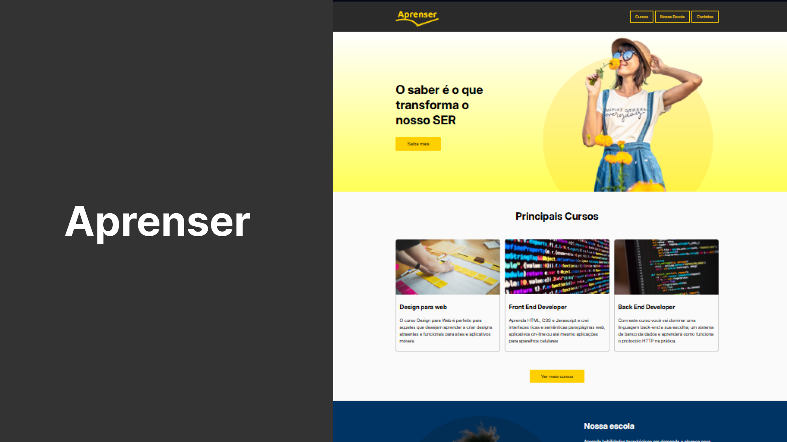

# 🚀 Projeto Aprenser

O **Projeto Aprenser** é uma plataforma de ensino online voltada para **tecnologia e desenvolvimento de habilidades digitais** 💻✨.

O site apresenta:  
- **Cursos principais**: Design para Web, Front End e Back End 🎨👨‍💻  
- **Nossa escola**: metodologia, estrutura e missão 🏫  
- **Contatos e localização**: mapa integrado e informações 📍📧  

💡 **Destaques do projeto:**  
- Layout **moderno e responsivo** 📱💻  
- Tipografia elegante com a fonte *Inter* 🖋️  
- Seções organizadas e botões que incentivam a interação 🔘  

🔗 **Acesse o site online no GitHub Pages:** [Projeto Aprenser](https://thamiressarges.github.io/aprenser)  
